# Technical Tools / 3RMW
#### Video Demo:  <https://youtu.be/N27c6m9DYLU>

# How It Works:
> Our website starts with the login page and / or register.
> It takes in the users input and check weather it is in the db or not.
> If it isnt in the database it adds it. The main purpose of the login is for the vault which is a unquie feature.
### Main Page:
> When you login or register first thing You will see is the main page which introduces you to our project aswell as gtreest your name
### Vault:
> Vault is a nice feature that allows the user to input a name of the website or subscription, their username for it, and the password(It will encrypt it)
> It will store that info in the database and when you look at the page it hsould be added with an option to delete what you put for the input.
> Functions that helped:
```python
def dec(password):
    for i in range(1):
      keygen = (random.randint(11111111111, 999999999999999))
    print("")
    message = password
    alphabet = "abcdefghijklmnopqrstuvwxyz1234567890!@#$%^&*()_+{}|:<>?=-[]\;',./`~ABCDEFGHIJKLMNOPQRSTUVWXYZ "
    key = 36
    encrypt =''
    for i in message:
      position = alphabet.find(i)
      newposition = (position+ -int(key) )%94
      encrypt += alphabet [newposition]
    return (encrypt)

def enc(password):
    message = password
    alphabet = "abcdefghijklmnopqrstuvwxyz1234567890!@#$%^&*()_+{}|:<>?=-[]\;',./`~ABCDEFGHIJKLMNOPQRSTUVWXYZ "
    key = 36
    encrypt =''
    for i in message:
        position = alphabet.find(i)
        new_position = (position+ int(key) )%94
        encrypt += alphabet[new_position]
    return (encrypt)
```
> How it was inserted:
> e is calling the enc function
```python
db.execute("INSERT INTO info (website, username, password, user_id) VALUES(?, ?, ?, ?)",Website,username, e, user_id)
```
### Encryption and Decryption:
> Encryptiona and Decryption are 2 programs that are linked together for programers to use if they want to make something secret.
### Live HTML:
> The life HTML is also a unique program that takes in code on the left side and shows the output for the code on the right(only HTML).
### Text Analyzer:
> Takes in input and gives you information of the text such as spaces and more.
### Calculator:
> The calculator is a program that as it says calculates what you put in and gives you the answer to your eqaution.
### The game:
> The game that we made was flappybird and was created using scratch and we used an iframe to embed it in.
### Change password:
> Allows you to put in you old and new password and changes it to the new one.
### Translator:
> Using an api from google we were able to make this work of art that translates the page of the website to the desired langauge.

## What we used and learnt:
#### For this website we have used 3 main sources [coolbackground.io](https://coolbackgrounds.io/) which provided the background for the homepage, and (https://www.w3schools.com/w3css/defaulT.asp) with in depth look in css and for the translator, as well as [Postimage](https://postimages.org/) for the image on the homescreen.
#### We used flask,css, and SQl for our website. We larnt how to use blocks a bit better in html and how to use sql lines to execute complex sql programs better.

## pictures:
Login and Register page
| Login | register |
| :---: | :---: |
| 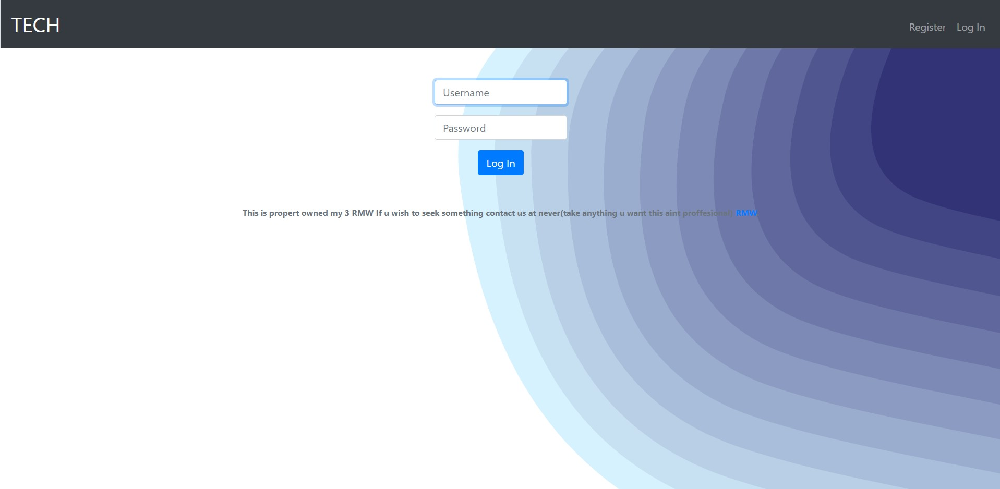  | 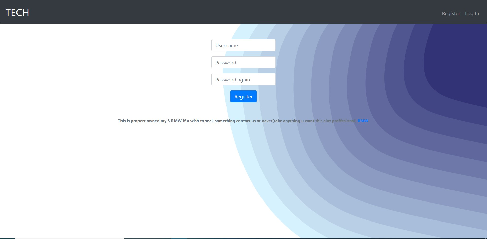|

| Homepage | Vault |
| :---: | :---: |
| 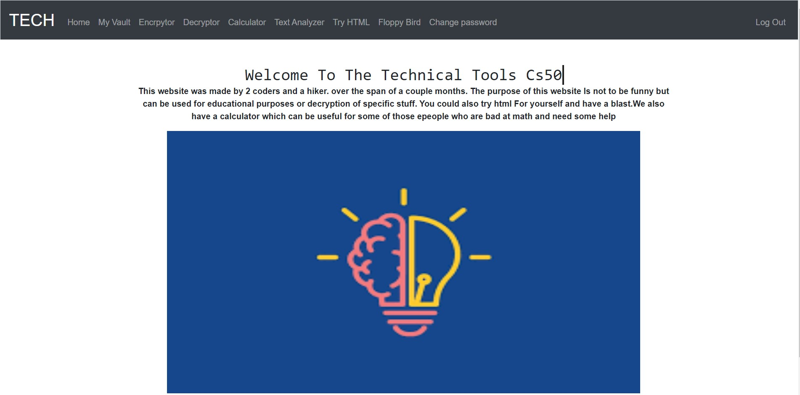  | 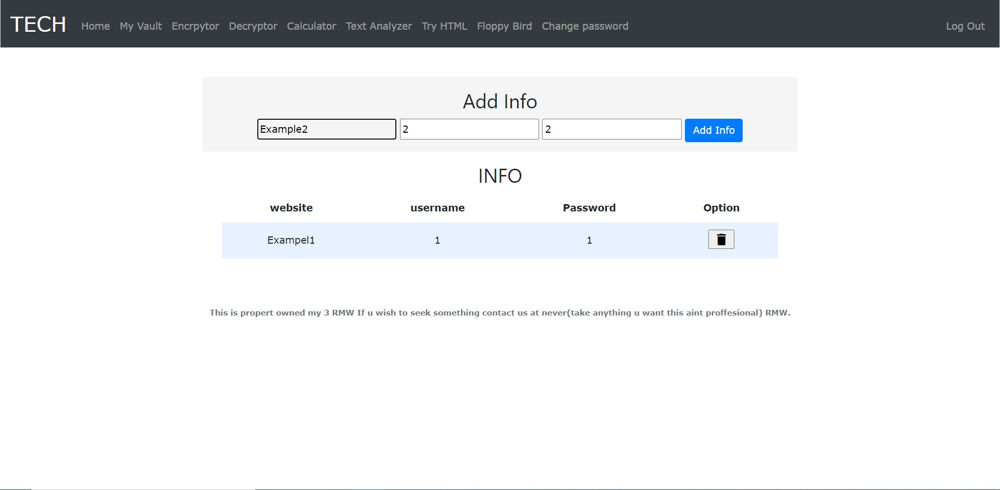|

| Encryption | Decryption |
| :---: | :---: |
| 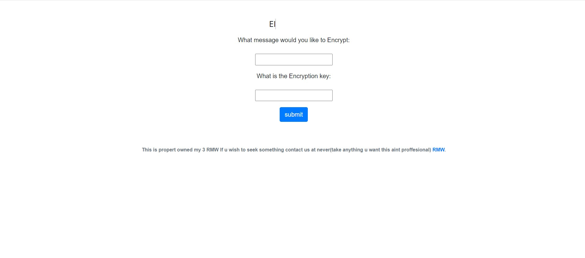  | 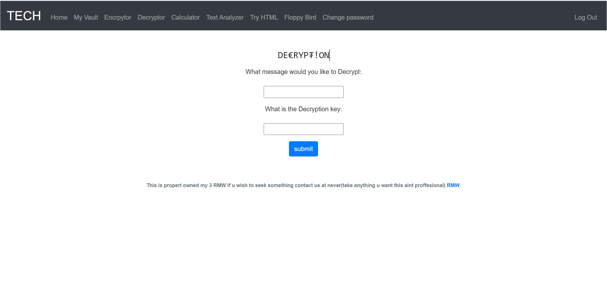|
    
| Text analyzer | Floppy bird |
| :---: | :---: |
| 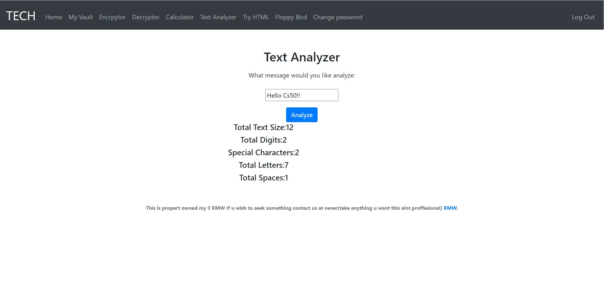  | 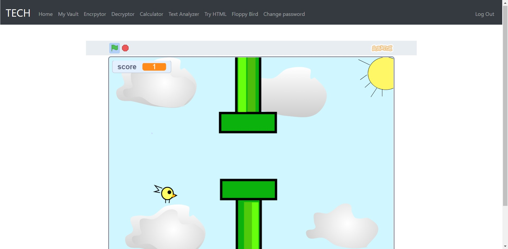|

| Calculator | Live HTML Editor |
| :---: | :---: |
| 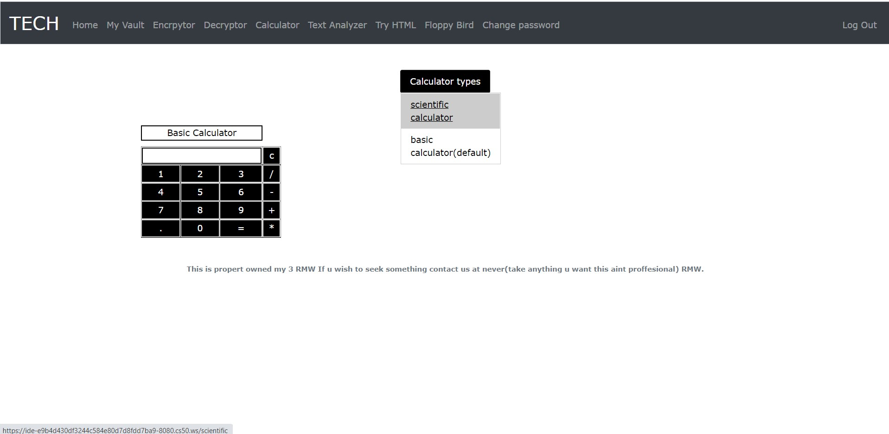  | 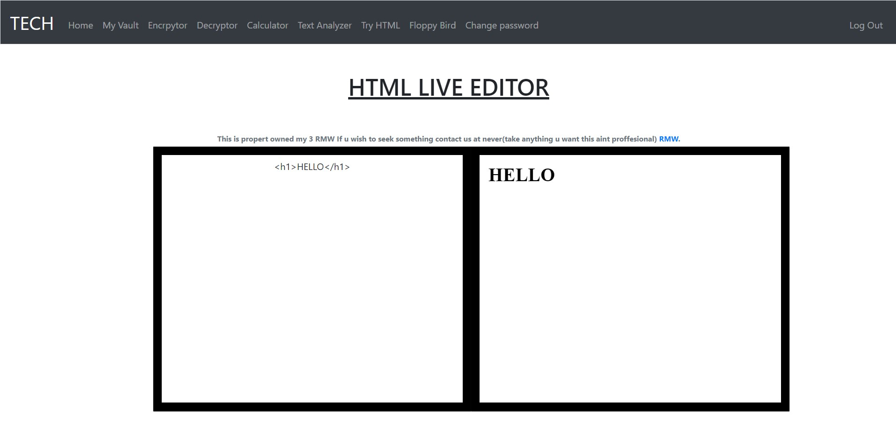|

| Check Password | Translator |
| :---: | :---: |
| 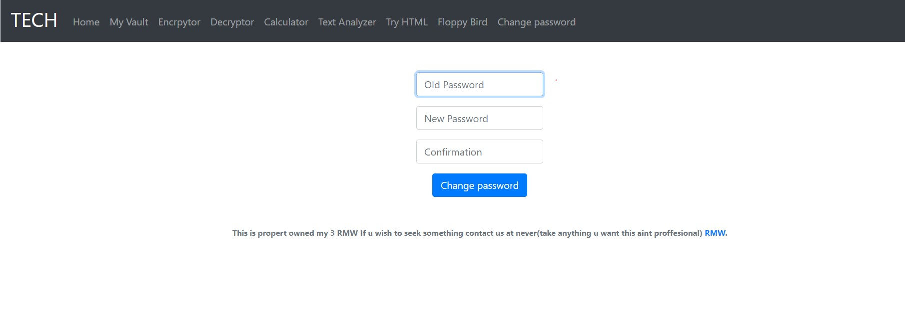 |  |
    
    
## contributions
 [Contributions](CONTRIBUTING.md)


